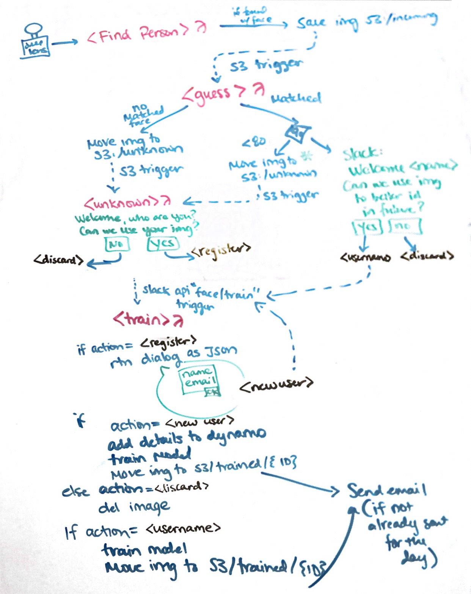

Doorman
-------
This will greet your coworkers on slack when they enter the office.

This was based in part on the [AWS Deeplens Hackaton](https://devpost.com/software/doorman-a1oh0e)

Setup
-----
Quite a few steps, needs cleanup, most of it can be automated.

- Using Cloud9 makes setup a breeze. If you create an instance, you might need to execute the following commands in the terminal window:
In Cloud 9, go to the gear icon in the upper right hand corner and navigate to project settings -> Python Support. Make sure the Python Version is Python 3. 
To use Python 3, use pip3 in commands instead of pip
-sudo yum -y install python36 # Installs Python 3.6.
  - npm install -g serverless
  - sudo yum install jq
  - pip install --user pipenv
  - sudo pip install --upgrade awscli
        if that command does not work, sudo python -m pip install --upgrade awscli 
  - source environment.sh
  - sls plugin install -n serverless-python-requirements

- Deploy the lambda functions with Serverles (eg: `sls deploy`), this will create a CF stack with your functions. Note the api gateway endpoint, you'll need it later

- Go into the deeplens console, and create a project, select the "Object detection" model
- Remove the `deeplens-object-detection` function, and add a function for `find_person`
- Deploy the application to your deeplens

- Go to the [slack api](https://api.slack.com/apps), and click "create a new app".
- Give a name, and select your workspace
- Activate:
  - Incoming webhooks
  - Interactive components (use the api gateway endpoint that you noted before, ignore `Load URL`)
  - Permissions: Install the app in your workspace, and note the token. You'll need `chat:write:bot`, `channels:read` and `incoming-webhook`.

- Now that the app is setup, set following env vars in your environment using the terminal:
  - SLACK_CHANNEL_ID="slack-channel-id"
  - SLACK_TRAINING_CHANNEL_ID="slack-channel-id"
  - SLACK_API_TOKEN=your-slack-token
- Deploy the app again with the new environment variables

For polly to work, you need to connect a speaker to the deeplens, add records of type "joke", "fact", and "quote" to the dynamodb info table. The type of item selected depends on the emotion detected on the person's face.

If you want your recognized team members to receive an email:
- Add records to the dynamodb info table with the type "news"
- Re-comment back in the "send_email" function call in train.py

That should be it. Whenever the Deeplens rekognizes someone, it will upload into the S3 bucket. Which will trigger the other lambda functions.

Architecture
------------
Original Architecture

Design Flow

Video
-----

Common Problems:
The role defined for the function cannot be assumed by the lambda. Solution here: https://silvaneves.org/the-role-defined-for-the-function-cannot-be-assumed-by-lambda/